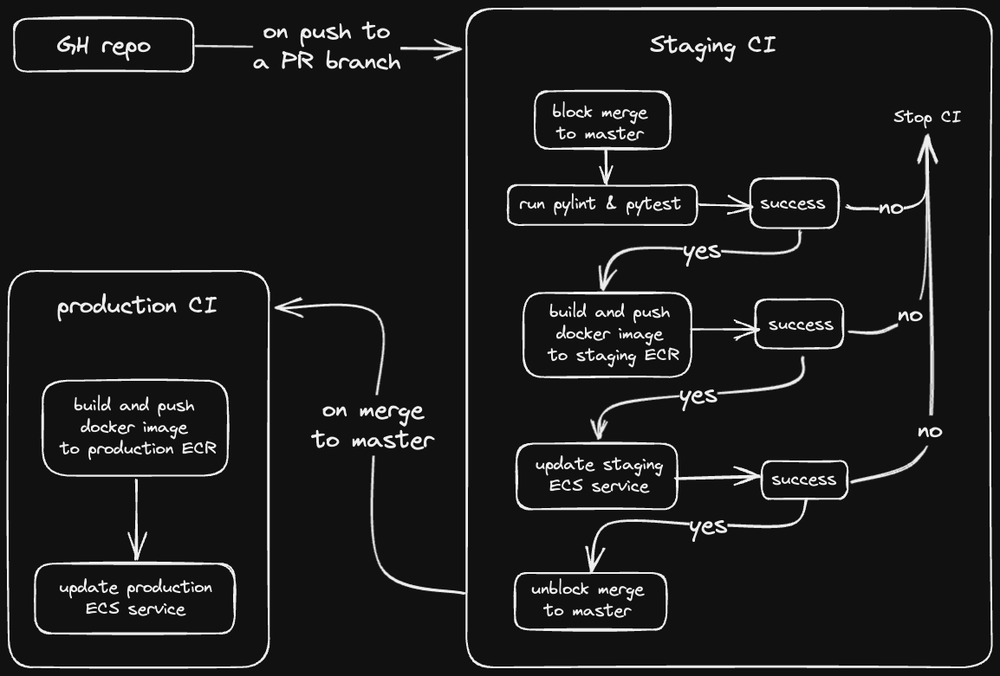

## Overview

This repository contains a tiny flask application, a couple of rudimentary tests, and a CI pipeline. The purpose of the project is to demonstrate the usage of CI to deploy the application using cloud resources

## Project requirements

1. Choose a version control system (e.g. Git) and create a new repository.
2. Create a simple web application using a language of your choice (e.g. Python Flask).
3. Create a Dockerfile to containerize the web application.
4. Choose a CI tool (e.g. Jenkins, CircleCI, Travis CI) and set up a new pipeline.
5. Configure the pipeline to listen to the repository for changes, and trigger a build when a new commit is made.
6. Build the Docker image, and push it to a container registry (e.g. Docker Hub).
7. Deploy the Docker container to a staging environment (e.g. a Kubernetes cluster) for testing.
8. Configure the pipeline to run automated tests against the deployed application, and fail the build if any tests fail.
9. If the tests pass, deploy the Docker container to a production environment.

---

## The application

A python flask application was chosen as the base of the project, as the [Flask](https://palletsprojects.com/p/flask/) framework allows to quickly set up a web server and expose endpoints to a specified port.

[PyTest](https://docs.pytest.org/) and [PiLint](https://pypi.org/project/pylint/) were chosen for testing suite.

## The pipeline

GitHub actions were chosen for the pipeline tool(s) for the following reasons:

- since they are native to GitHub:
  - they integrate with the VCS seamlessly;
  - using them instead of another tool means one less vendor/platform/dependency/configuration/expense to worry about;
- they support hosted and on-premise runners;
- there is a large and active community around them;

### Workflows:

There are two workflows described in `/.githib/workflows`:

- on each new commit made to a PR branch:
- merging to the master branch is blocked;
- the application is:
  - tested;
  - build into a docker image
  - pushed to AWS ECR;
  - deployed in an AWS ECS ;
- once the above flow runs successfully:
- merging to the master branch is allowed;
- on merge to the master branch:
  - docker image is build;
  - the image is pushed to AWS ECR;
  - the image is deployed in an AWS ECS;

The full flow of the pipeline is as follows:

## The infrastructure

The CI pipeline relies on AWS cloud infrastructure to be deployed. The required resources are managed by Terraform in [this repository](https://github.com/BKmetoff/endurosat-assignment-infra).

## Notes:

- To ensure the pipeline executes the GH actions successfully:
  - the infrastructure that the application is requires on must be already deployed;
  - the AWS IAM role that's assumed by the OIDC token must be hardcoded into `.github/workflows/update-ecs-cluster.yaml`;
  - the AWS account id must be stored as a [GitHub secret](https://docs.github.com/en/actions/security-guides/encrypted-secrets);
  - the correct AWS region must be added as an environment variable in `.github/workflows/ci-production.yaml` and `.github/workflows/ci-staging.yaml`

## Room for improvement:

- An additional GH workflow could be added to post a comment on merged PRs after the application has been successfully deployed to production.
- In addition to the above, the same or another GH action could send a notification to the PR author and/or to whoever has triggered the merge, e.g. a Slack message.
